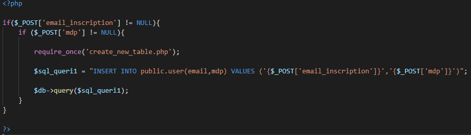
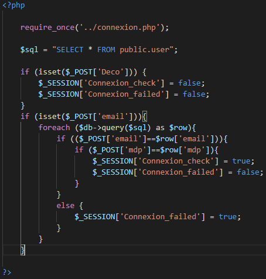

## Connexion avec base de données

### Création de la table User

Le fichier create_new_table.php va permettre de créer la table si elle n'exsite pas. 

### Inscription Utilisateur

### Connexion Utilisateur

